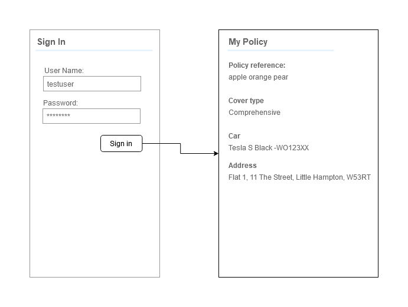

## By Bits Code Challenge

### Wireframe



### User Story

```
As a policy holder,

I can login successfully and view my current policy information,

So that I can view my policy details.
```

## Technologies

- React Native (+ Expo CLI)

3rd party libraries
- @react-navigation
- @react-native-async-storage/async-storage

### Notes

- You cannot proceed to the next page with either or both of the login fields blank. An error message will appear when this is attempted. 
- I chose React Native as I am currently learning it. It was nice learn how to use an API within React Native as I have never done it within that language before.
- I did not include tests. Sadly I struggled to impliment working tests. Therefore I prioritied the product.
- I added a small amount of css styling.

### Time spent

8 hours

### How to run

Clone the project locally:
```
https://github.com/Charlotte-91/by-bits-tech-challenge.git
```
Navigate to the project folder and then navigate into the react project:
```
cd byBitsTechChallenge
```
Install the project:
```
npm install
```
Run the project:
```
npm run web
```
The project will then run in your web browser via Expo CLI.

Note: It may take a few minutes to load up

### Screenshots


